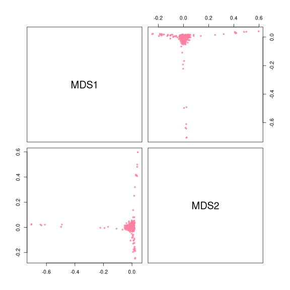
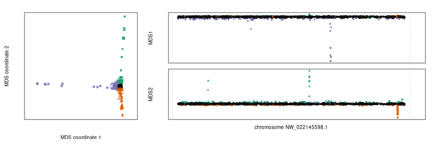
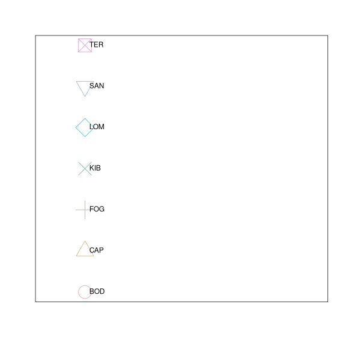
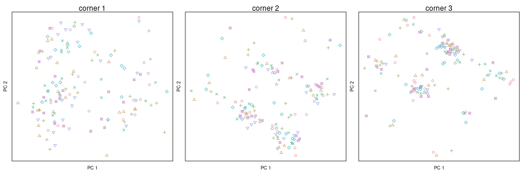
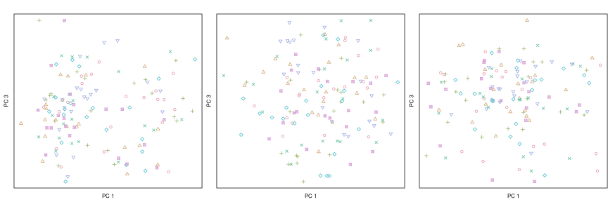
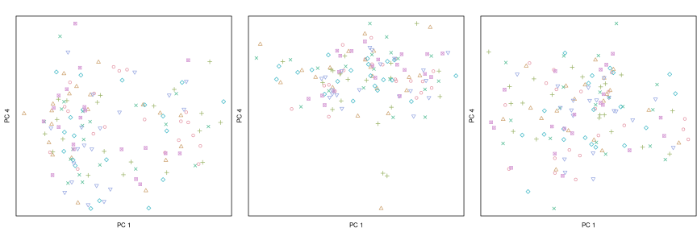
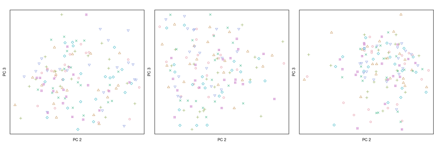
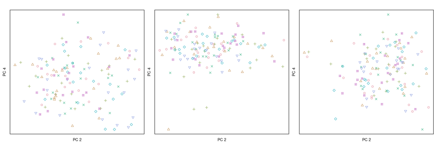
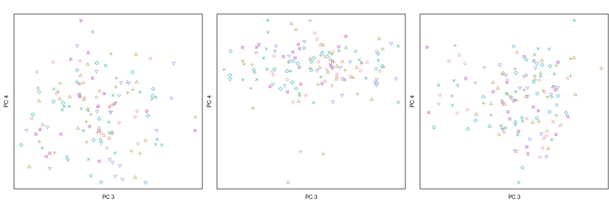

Render this, for instance, like:
```
templater::render_template("summarize_run.Rmd",output="lostruct_results/type_snp_size_10000_jobid_324902/run_summary.html",change.rootdir=TRUE)
```


This run had these parameters:

- *window type* : snp
- *window size* : 1500
- *number of pcs* : 2
- *number of MDS coordinates* : 2

Here are the number of windows per chromsome,
and the computed MDS coordinates, colored by chromosome:

```r
table(regions$chrom)
```

```
## 
## NW_022145598.1 
##           3042
```

```r
pairs( mds.coords[,mds.cols], pch=20, col=adjustcolor(chrom.cols,0.75) )
```

<div class="figure" style="text-align: center">

<p class="caption">plot of chunk mds_pairplot</p>
</div>

```r
if (do.pdfs) { pdf_copy() }
```

```
## pdf version at: figure/run_summary/mds_pairplot-1.pdf
```

```
## png 
##   2
```

Here are the extreme windows in the MDS plot:

```r
mds.corners <- corners( mds.coords[,mds.cols[1:2]], prop=.05 )
# set up colors and pchs for corners
corner.cols <- brewer.pal(3,"Dark2")
corner.pch <- c(15,17,19)
ccols <- rep("black",nrow(mds.coords))
cpch <- rep(20,nrow(mds.coords))
for (k in 1:ncol(mds.corners)) {
    ccols[ mds.corners[,k] ] <- corner.cols[k]
    cpch[ mds.corners[,k] ] <- corner.pch[k]
}
# centroids of the corners in MDS space
corner.mds <- do.call(rbind, lapply(1:ncol(mds.corners), 
                function (ii){
                    colMeans(mds.coords[mds.corners[,ii],-(1:2)])
                } ) )
```

```r
# plot corners and MDS along the chromosome
spacing <- 1
opar <- par(mar=c(4,4,2,1)+.1,mgp=c(2.5,0.8,0))
layout(matrix(c(rep(1,length(mds.cols)),1+seq_along(mds.cols)),ncol=2),
        widths=c(1,2), heights=layout_heights(length(mds.cols),dl=spacing,ncol=2))
plot( mds.coords[,mds.cols[1:2]], pch=cpch, 
     col=adjustcolor(ccols,0.75),  asp=1,
     xaxt='n', yaxt='n',
     xlab="MDS coordinate 1", ylab="MDS coordinate 2" )
points( corner.mds, pch=20, cex=5,
        col=adjustcolor(corner.cols,0.25))
text( corner.mds, labels=seq_len(nrow(corner.mds)), 
        col=corner.cols, cex=2, lwd=2 )
opar2 <- par(mar=c(par("mar"),spacing/2)[c(5,2,3,4)])
for (k in mds.cols) {
    lastone <- (k==mds.cols[length(mds.cols)])
    if (lastone) { par(mar=c(par("mar"),opar2$mar[1])[c(5,2,3,4)]) }
    chrom.plot( mds.coords[,k], pch=20, 
            xlab=if (lastone) { "Position (Mb)"} else { "" }, # main=paste("MDS coordinate",match(k,mds.cols)),
            chrom.labels=lastone,
            ylab=colnames(mds.coords)[k],
            col=adjustcolor(ccols,0.75) )
    # do this for all but first
    par(mar=c(par("mar"),spacing/2)[c(1,2,5,4)])
}
```

<div class="figure" style="text-align: center">

<p class="caption">plot of chunk plot_corners</p>
</div>

```r
par(opar)
if (do.pdfs) { pdf_copy() }
```

```
## pdf version at: figure/run_summary/plot_corners-1.pdf
```

```
## png 
##   2
```


Now, we'll look at PCA plots from the extracted corners.
(this is done without a ton of memory by accumulating the covariance matrix in `running_cov`):

```r
corner.npc <- 4
corner.regions <- vector(mode='list', length=ncol(mds.corners))
for (k in seq_along(corner.regions)) {
    corner.regions[[k]] <- regions[ mds.corners[,k],]
}
write.csv(corner.regions[[1]], "first_corner.csv", row.names=FALSE)
corner.covmats <- vector(mode='list', length=ncol(mds.corners))
for (k in seq_along(corner.covmats)) {
    reg <- regions[ mds.corners[,k], ]
    qfun <- multi_vcf_query_fn( chrom.list=chroms, file=bcf.files, regions=reg )
    corner.covmats[[k]] <- running_cov(qfun,1:nrow(reg), normalize.rows=TRUE)
}
corner.pca <- vector(mode='list', length=ncol(mds.corners))
for (k in seq_along(corner.pca)) {
    corner.pca[[k]] <- cov_pca(covmat=corner.covmats[[k]], k=corner.npc, w=opt$weights)
}
```

Here is the color scheme:

```r
pop.names <- levels(samps$population)
pop.cols <- rainbow_hcl(nlevels(samps$population))
pop.pch <- seq_len(nlevels(samps$population))
plot( rep(1,length(pop.names)), seq_along(pop.names), 
       cex=4, pch=pop.pch, col=pop.cols, xlim=c(0,length(pop.names)),
       xlab='', ylab='', xaxt='n', yaxt='n' )
text( rep(1,length(pop.names)), seq_along(pop.names), labels=pop.names, pos=4 )
```

<div class="figure" style="text-align: center">

<p class="caption">plot of chunk pop_colors</p>
</div>


Here are all pairwise plots of the first 4 PCs for each of the three corners:

```r
layout(t(1:3))
for (i in 1:(corner.npc-1)) {
    for (j in (i+1):corner.npc) {
        for (k in 1:ncol(mds.corners)) {
            vectors <- matrix( corner.pca[[k]][-(1:(1+corner.npc))], ncol=corner.npc )[,c(i,j)]
            colnames(vectors) <- paste("PC", c(i,j))
            par(mgp=c(0.7,0.7,0), mar=c(2,2,2,0)+.1)
            plot(vectors, pch=pop.pch[samps$population], 
                    col=pop.cols[samps$population],
                    xaxt='n', yaxt='n' )
            if (i==1 && j==2) {
                mtext(paste("corner",k),side=3)
            }
        }
        if (do.pdfs) { pdf_copy(plot.id=paste(i,j,sep="_")) }
    }
}
```

<div class="figure" style="text-align: center">

<p class="caption">plot of chunk plot_corner_pca</p>
</div>

```
## pdf version at: figure/run_summary/plot_corner_pca-1_1_2.pdf
```

<div class="figure" style="text-align: center">

<p class="caption">plot of chunk plot_corner_pca</p>
</div>

```
## pdf version at: figure/run_summary/plot_corner_pca-1_1_3.pdf
```

<div class="figure" style="text-align: center">

<p class="caption">plot of chunk plot_corner_pca</p>
</div>

```
## pdf version at: figure/run_summary/plot_corner_pca-1_1_4.pdf
```

<div class="figure" style="text-align: center">

<p class="caption">plot of chunk plot_corner_pca</p>
</div>

```
## pdf version at: figure/run_summary/plot_corner_pca-1_2_3.pdf
```

<div class="figure" style="text-align: center">

<p class="caption">plot of chunk plot_corner_pca</p>
</div>

```
## pdf version at: figure/run_summary/plot_corner_pca-1_2_4.pdf
```

<div class="figure" style="text-align: center">

<p class="caption">plot of chunk plot_corner_pca</p>
</div>

```
## pdf version at: figure/run_summary/plot_corner_pca-1_3_4.pdf
```


